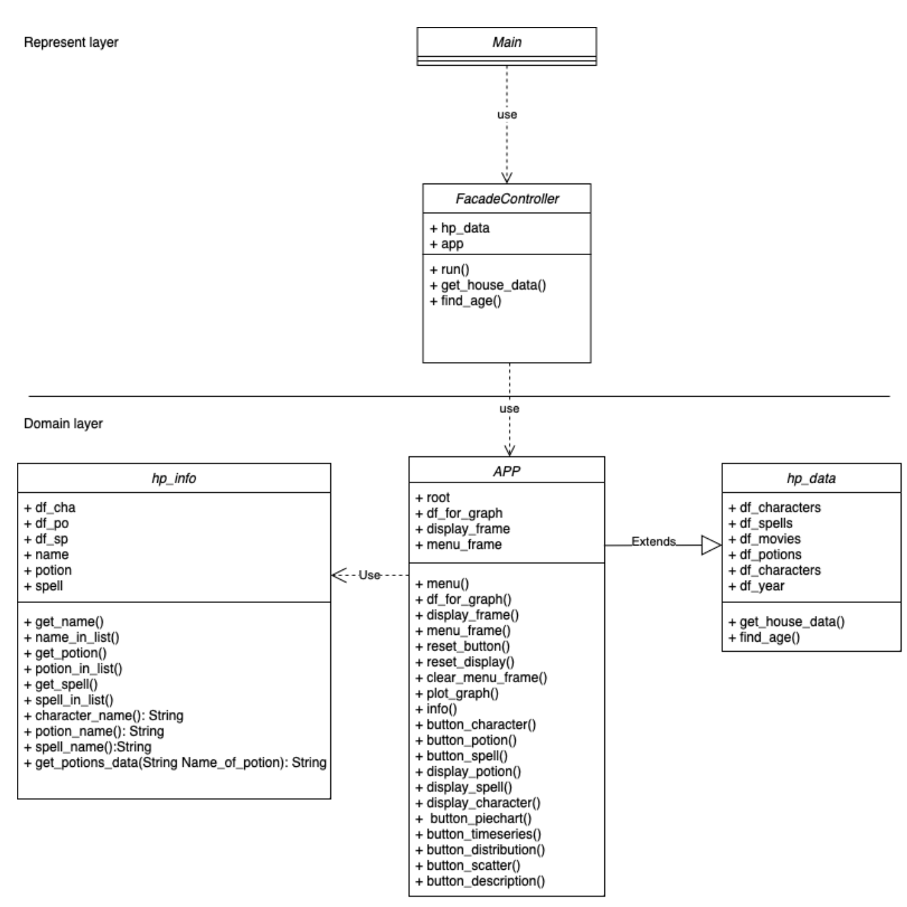
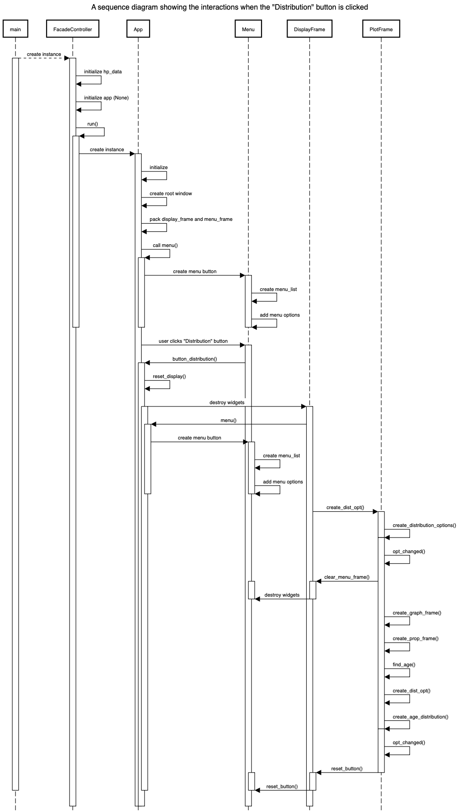

# Harry Potter Movies
 
## Description
The Harry Potter is a collection of various types of data related to the popular 
book and movie series. A Harry Potter data set project is an exciting opportunity 
to delve into the intricacies of the Wizarding World. The project involves 
cleaning and preparing data related to the characters, spells, potions, budget, 
and box office revenue for each part of the series.


## Data Sources
The data is collected from the following sources:
- [harry-potter-movies-dataset](https://www.kaggle.com/datasets/kornflex/harry-potter-movies-dataset)
- [harry-potter-dataset](https://www.kaggle.com/datasets/maricinnamon/harry-potter-movies-dataset)
 
## Running the Application
- Install the dependencies using the following command:
```bash
pip3 install requests
```
```bash
pip3 install io
```
```bash
pip3 install pandas
```
```bash
pip3 install matplotlib
```
```bash
pip3 install Pillow
```

- Run the application using the following command:
```bash
python3 main.py
```

## Design


From the above diagram, the following classes are used:
- FacadeController
- hp_data
- App
- hp_info


From the above sequence diagram, the following classes are used:
- FacadeController
- App
which I use to showing when the Distribution button is clicked.
 
## Design Patterns Used
From my project, I have used the following design patterns:
- Facade Pattern

I have used the facade pattern to provide a simple interface to the complex
subsystem of the Harry Potter data set. The facade pattern is used to hide the
complexity of the system and provide a simple interface to the user.

 
## Graph Algorithm Used
Determine who has the most enemies, who has the least enemies, and who is the
friendliest with whom.

Algorithm: 
- WhateverFirstSearch (BFS, DFS)

## Other Information
Interesting in the project:
- matplotlib.backends.backend_tkagg

From this module, I have used the FigureCanvasTkAgg class to display the 
matplotlib figure in the tkinter window.

my class diagram starts from the main.py file main.py will call the FacadeController
class and the FacadeController class will call the App class which inheriting from the
hp_data class and use the hp_info class to get the data.

from my sequence diagram, I have used to showing when the Distribution button is clicked.

and from my facade pattern, I have used to hide the complexity of the system and provide
a simple interface to the user.

Container and widget choices
- tk.Frame use to create a container for other widgets.
- tk.Label use to display text or images.
- tk.Button use to add buttons to the application.
- tk.Menu use to add menus to the application.
- matplotlib.backends.backend_tkagg use to display the matplotlib figure in the tkinter window.
layout design
my layout design is have 2 frame one for the left side and one for the right side
left side frame is for the menu and the button
right side frame is for the graph and the data

Data source(s)
I use 2 data source from kaggle
- harry-potter-movies-dataset
- harry-potter-dataset

Processing data 
from my project, I have used the pandas module to read the csv file and use the
matplotlib module to create the graph.
the first graph is the part to whole which is the pie chart.This graph will show
the percentage of the house in the harry potter series.
the second graph is the distribution which is the histogram.This graph will show
the distribution of the age of the character in the harry potter series.
the third graph is the time series which is the line graph.This graph will show
the year of the character born in the harry potter series.
the last graph is the correlation which is the scatter plot.This graph will show
the correlation between the budget and the box office in the harry potter series.

Visualization
the first graph is the objective to show the percentage of the house in the harry potter series.
the graph show that the Gryffindor house is the most popular house in the harry potter series.
the graph type is the pie chart. because the pie chart is the best way to show the percentage.

Extra features
my extra features is show information about the character,spell, and potion.
when click character button it will show the character information.which have
picture of the character, Species, Gender, House, Date of birth, Ancesrty, Pratonus,
and Actor.
when click potion button it will show the potion information.which have
Name, ingredients, Effect, Characteristics and Level of difficulty.
when click spell button it will show the spell information.which have
Name, Incantation, Type, Effect, and Light.

Demonstration:
my program have 2 frame one for the left side and one for the right side
from menu you can select the information that you want to see. and plot the graph
if you click the information button it will show the information you want to know
character, potion, and spell.
if you click the plot button it will show the topic you want to plot
Part to whole, Distribution, Time series, Correlation and descriptive part.